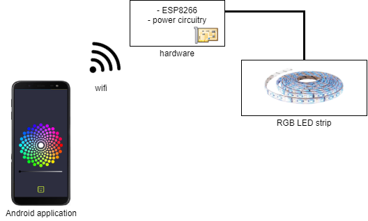

## The Ambience Project

Ambience is a room environment controller.

The project mainly intends to create a LED light controller, with the user interface
being a smartphone application. Project evolution includes automation of power
outlets, which may be used to control fans, heaters and other utilities.

### Overview

The project contains three parts with their respective repositories:

1. [Android application](https://github.com/jeajjr/ambience-android)
2. [Hardware project](https://github.com/jeajjr/ambience-hardware)
3. [ESP8266 python application](https://github.com/jeajjr/ambience-python)

### Functionalities

Current implementation allows to choose color and light intensity for the RGB LED
strip.

### Future work

Future functionalities include:

- Set up timers for turning the light on and off
- Add external relay board control on Android and python applications
- Implement some method of authentication should be implemented to avoid agents 
other than the Ambience Android application to send commands.